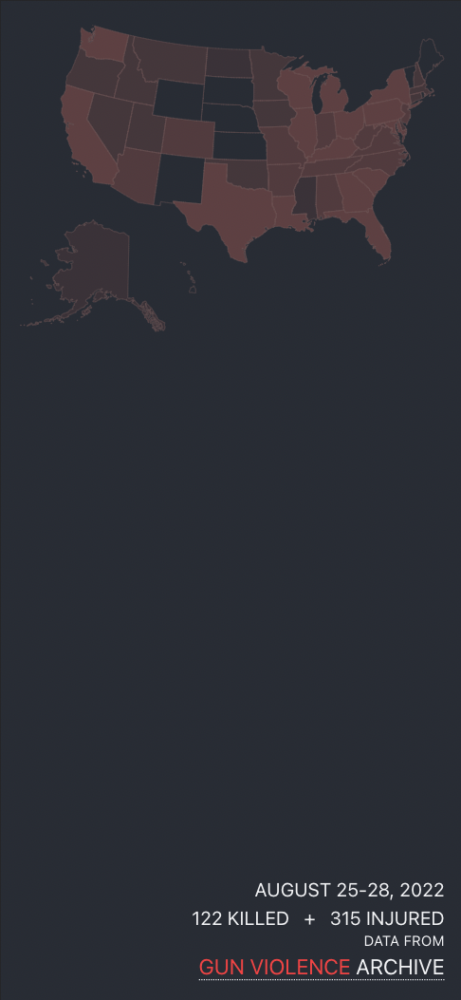
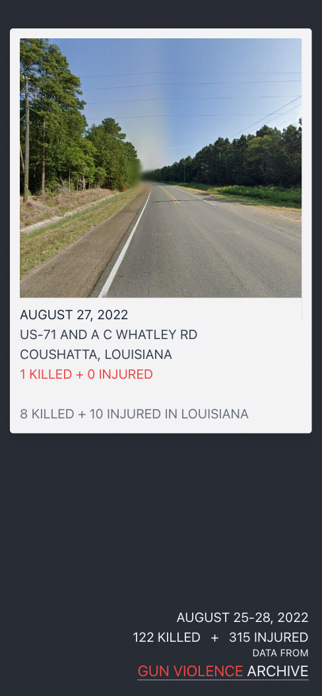
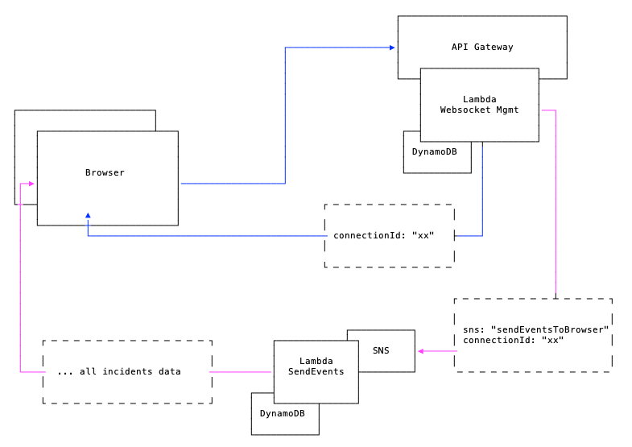
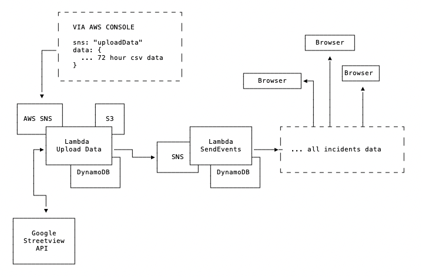

## INTRO

DEMO: [https://nomastickles.github.io/gunshots/](https://nomastickles.github.io/gunshots/)

The backend and frontend code of this project houses and visualizes data provided by [gunviolencearchive.org](https://www.gunviolencearchive.org).

This system is a teaching aid for a Udemy course that will also bring awareness to [gunviolencearchive.org](https://www.gunviolencearchive.org/about) initiatives.

|                 mobile example 1                  |                 mobile example 2                  |
| :-----------------------------------------------: | :-----------------------------------------------: |
|  |  |

|                  desktop example                  |
| :-----------------------------------------------: |
|  |

## BACKEND

- Serverless Framework + Typescript + Tests
- AWS IAM, Lambda, API Gateway Websockets, DynamoDb, SNS, S3, SSM
- Google Street View Images API
- Github Actions CI/CD

## FRONTEND

- React + Redux Toolkit + Typescript + Tests
- Tailwind CSS Responsive Design, Animate.css
- Github Actions + Github Pages CI/CD

## BROWSER / WEBSOCKET CONNECTIONS



## DATA UPLOAD



## DYNAMODB STRUCTURE

DynamoDB holds three data structures: websocket connections, gunshot incident records, and settings.

example websocket connection

```json
{
  "PK": {
    "S": "298dJsl3="
  },
  "GSPK": {
    "S": "connection"
  },
  "GSSK": {
    "N": "1659837127120"
  }
}
```

example item with PK "incidents" holding incident array in DATA

```json
{
  "PK": {
    "S": "incidents"
  },
  "DATA": {
    "S": "[{\"date\":\"September 13, 2021\",\"state\":\"Illinois\",\"city\":\"Chicago\",\"address\":\"8700 block of S State\",\"killed\":0,\"injured\":1,\"id\":\"sijzhh:1231232\",\"image\":\"https://some-bucket.amazonaws.com/1231232.jpeg\"}]"
  },
  "GSPK": {
    "S": "data"
  },
  "GSSK": {
    "N": "1659837126612"
  }
}
```

example setting

```json
{
  "PK": {
    "S": "websocket"
  },
  "DATA": {
    "S": " wss://abcde.execute-api.us-east-1.amazonaws.com/dev1"
  },
  "GSPK": {
    "S": "setting"
  },
  "GSSK": {
    "N": "1659837127120"
  }
}
```

## STEPS TO RUN

### 0. FORK THE REPO

### 1. ADD GITHUB REPO SECRETS

example:

```sh
AWS_ACCOUNT_ID
AWS_ACCESS_KEY_ID
AWS_SECRET_ACCESS_KEY
AWS_DEFAULT_REGION
S3_NAME # unique s3 prefix
```

### 2. (OPTIONAL) GET GOOGLE STREETVIEW API KEY

Add Google API key to AWS Systems Manager Parameter Store with path /gunshots/googleAPIKey

Please see [https://developers.google.com/maps/documentation/streetview/usage-and-billing](https://developers.google.com/maps/documentation/streetview/usage-and-billing) for details on Google API usage and costs.

### 3. UPLOAD 72 HOUR CSV

- get csv from [https://www.gunviolencearchive.org/last-72-hours](https://www.gunviolencearchive.org/last-72-hours)
- add csv to ./backend/csv

### 4. MERGE TO MAIN (BACKEND DEPLOY)

The "Deploy Backend" github action workflow should output a new websocket wss:// address. We'll use this when deploying the frontend.

NOTE: AWS region is redacted from the github action output for websocket to be sure to replace \*\*\* with the appropriate region you are working in.

Example:

```
💥 updateWebsocket
Stack Output processed with handler: scripts/stackOutput.handler
🤝 websocket updated wss://abcdefg.execute-api.***.amazonaws.com/dev
```

### 5. FRONTEND DEPLOY

Note this only once per unique websocket.

Manually run "Deploy Frontend" Github action workflow using new websocket address. Github pages will be employed to host the app using the websocket address.
