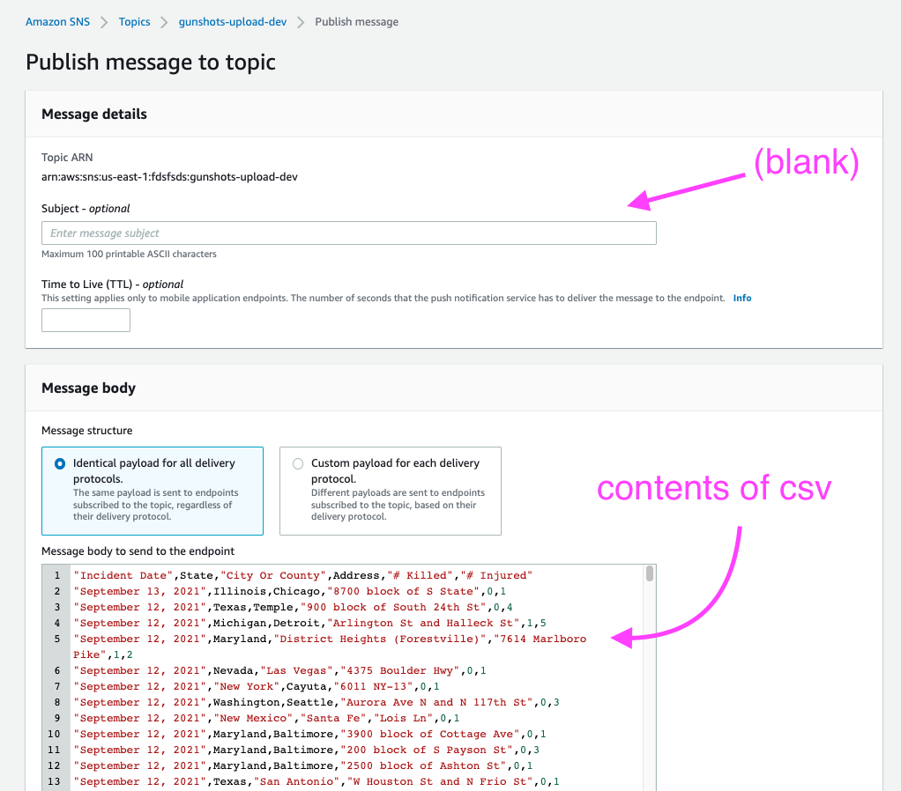

## INTRO

DEMO: [https://nomastickles.github.io/gunshots/](https://nomastickles.github.io/gunshots/)

The backend and frontend code of this project houses and visualizes data provided by [gunviolencearchive.org](https://www.gunviolencearchive.org).

This system is a teaching aid for a Udemy course that will also bring awareness to [gunviolencearchive.org](https://www.gunviolencearchive.org/about) initiatives.

|                 mobile example 1                  |                 mobile example 2                  |
| :-----------------------------------------------: | :-----------------------------------------------: |
|  |  |

|                  desktop example                  |
| :-----------------------------------------------: |
|  |

## BACKEND

- Serverless Framework + Typescript + Tests
- AWS IAM, Lambda, API Gateway Websockets, DynamoDb, SNS, S3, SSM
- Google Street View Images API

## FRONTEND

- React + Redux Toolkit + Typescript + Tests
- Tailwind CSS Responsive Design, Animate.css

## DATA UPLOAD


## WEBSOCKET CONNECTIONS


## DYNAMODB STRUCTURE

DynamoDB holds three data structures: websocket connections, gunshot incident records, and settings.

Item with PK "incidents" holds Incident[] in DATA

```json
{
  "PK": {
    "S": "incidents"
  },
  "DATA": {
    "S": "[{"date":"September 13, 2021","state":"Illinois","city":"Chicago","address":"8700 block of S State","killed":0,"injured":1,"id":"sijzhh:1231232","image":"https://some-bucket.amazonaws.com/1231232.jpeg"}]"
  },
  "GSPK": {
    "S": "data"
  },
  "GSSK": {
    "N": "1659837126612"
  }
}
```

### SETTINGS

example websocket setting

```json
{
  "PK": {
    "S": "websocket"
  },
  "DATA": {
    "S": " wss://abcde.execute-api.us-east-1.amazonaws.com/dev1"
  },
  "GSPK": {
    "S": "setting"
  },
  "GSSK": {
    "N": "1659837127120"
  }
}
```

## STEPS TO RUN

### 1. ADD ./backend/config.js

example:

```js
module.exports.aws = {
  accountId: "xxx",
  region: "us-east-x",
  s3NamePrefix: "somePrefix",
};
```

### 2. BACKEND DEPLOY

```sh
STAGE=dev cd backend && yarn && yarn deploy
```

example output:

```
Stack Output:
  ServiceEndpointWebsocket: wss://NEW-WEBSOCKET.execute-api.us-east-1.amazonaws.com/dev

```

### 3. SAVE GOOGLE STREETVIEW API

Add Google API key to AWS Systems Manager Parameter Store with path /gunshots/googleAPIKey

Please see [https://developers.google.com/maps/documentation/streetview/usage-and-billing](https://developers.google.com/maps/documentation/streetview/usage-and-billing) for details on Google API usage and costs.

### 4. UPLOAD 72 HOUR CSV (two options)

- get csv from [https://www.gunviolencearchive.org/last-72-hours](https://www.gunviolencearchive.org/last-72-hours)
- send csv data via sns through AWS console



OR

for local upload see [backend/csv/README.md](backend/csv/README.md)

### 5. FRONTEND DEPLOY

```sh
cd frontend && yarn && yarn start
```

- Via UI add ServiceEndpointWebsocket output to frontend input
